# Adoção de animais

**Andressa Cordeiro Kahn, ackahn@sga.pucminas.br**

**Anira Carolina Meneses de Carvalho Moura, acmcmoura@sga.pucminas.br**

**Gabriel Bernardo, gabriel-ber@outlook.com**

**Luiz Carlos Ferreira da Silva, lcferre20@gmail.com**

**Rafael Machado Bueno, rbueno@sga.pucminas.br**

---

Professora: Juliana Amaral Baroni de Carvalho

---

_Curso de Sistemas de Informação_

_Instituto de Informática e Ciências Exatas – Pontifícia Universidade de Minas Gerais (PUC MINAS), Belo Horizonte – MG – Brasil_

---

**Resumo**. _Este projeto procura apresentar uma solução para simplificar o processo de adoção de animais. Por meio do uso de um sistema de informação capaz de automatizar os processos, busca-se proporcionar mais facilidade para que doadores divulguem animais disponíveis e adotantes os encontrem, contribuindo para a redução nos índices de animais abandonados no país._

---

## 1. Introdução

A relação afetiva entre animais e seres humanos vem se estreitando ao longo dos séculos ao ponto de nos dias atuais vermos cada vez mais os animais domésticos inseridos no ambiente familiar dos brasileiros. Apesar desta estreita relação, infelizmente ainda estão muito presentes em nossa sociedade os maus tratos cometidos pelos seres humanos.

Embora tenhamos um panorama muito favorável quanto à relação posse responsável-animais, a realidade não é nada favorável quanto aos animais que são descartados, tendo que conviver com realidades desfavoráveis quanto a desnutrição, parasitas, doenças, envenenamento e outras formas de abuso. Os casos de abandono de animais constituem um grande problema para a sociedade atual, causando consequências para a ecologia, economia, saúde pública e bem-estar animal.

A Organização Mundial de Saúde (OMS) estima que existam no Brasil mais de 30 milhões de animais vivendo em situação de abandono (SOUZA, 2020). Esta realidade é comum no dia a dia das ONGs brasileiras, que têm mais de 172 mil animais abandonados sob seu cuidado, de acordo com levantamento do Instituto Pet Brasil (2020). Estas ONGs realizam trabalhos de resgate e encaminhamento dos animais para adoção responsável, dependendo de meios diversos para encontrar potenciais adotantes, como feiras de adoção, anúncios em sites especializados e, principalmente, divulgação em redes sociais.

Nesse contexto, este projeto surge da necessidade de propor melhorias ao processo de adoção de animais. Por meio do uso de um sistema de informação capaz de automatizar os processos, busca-se proporcionar mais facilidade para que os doadores divulguem os animais disponíveis e os adotantes os encontrem, de forma prática e organizada, contribuindo para a redução nos índices de animais abandonados no país.

### 1.1.  Objetivos geral e específicos

Este projeto tem como objetivo principal analisar a situação atual do processo de negócio relacionado ao contexto da adoção de animais e investigar as oportunidades de melhoria por meio do uso de um sistema de informação.

São objetivos específicos do projeto:

- Investigar as necessidades dos participantes de negócio no contexto da adoção de animais e como poderiam ser impactados com sua automatização;
- Analisar como os processos de adoção e cadastro de animais, adotantes e doadores são realizados atualmente, buscando identificar oportunidades de automatização e melhoria;
- Avaliar as possibilidades e impactos do emprego de um banco de dados para implementação do processo de negócio;
- Analisar o desempenho da solução proposta.

### 1.2. Justificativas

Não obstante haver um grande número de animais abandonados no Brasil, temos estes números agravados por todos os problemas decorrentes da pandemia de COVID-19. Dados divulgados pela ONG Ampara Animal apontam que o abandono aumentou, em média, 60%, entre julho de 2020 e março de 2021, em comparação com o mesmo período em anos anteriores (DAVIES, 2021). Faltam políticas mais eficazes quanto a processos relacionados ao ciclo básico de abandono desses animais.

Com este projeto, esperamos impactar positivamente no processo de adoção de animais otimizando as etapas do processo, facilitando a conexão e compatibilidade entre perfis de animais e candidatos a adotantes e aumentando a conscientização sobre adoção responsável.

## 2. Participantes do processo

Os participantes chave do processo de negócio são os doadores e os potenciais adotantes em busca de um animal. Estes participantes são também o público-alvo do serviço.

### 2.1. Doadores

São as pessoas físicas ou instituições que possuem sob sua tutela animais disponíveis para adoção. Têm como objetivo divulgar os animais para que as adoções sejam realizadas de forma rápida, mas responsável, evitando que o animal seja devolvido ou abandonado posteriormente. Carecem de meios de divulgação eficazes, com boa visibilidade e procedimentos padronizados que facilitem adoções responsáveis.

- A automatização do processo de adoção pode impactar os doadores em diversos fatores:
- O uso de um banco de dados facilitará a listagem e divulgação dos animais disponíveis para adoção, o que pode trazer mais visibilidade e eficácia às adoções;
- O doador poderá cadastrar, atualizar e excluir os dados dos animais de forma fácil e remota, gerando um banco de dados padronizado e organizado;
- Redução do grau de variabilidade no processo de adoção a partir de sua padronização, conferindo maior previsibilidade e melhores resultados.

### 2.1. Adotantes

São as pessoas que buscam encontrar animais disponíveis para adoção. Para eles, é importante conhecer os requisitos e procedimentos da adoção, bem como obter o máximo de informações possíveis sobre o animal e sua localização antes mesmo de realizar algum deslocamento físico.

Adotantes buscam animais compatíveis com suas necessidades e estilo de vida, portanto procuram ver fotos e obter informações completas, detalhadas e atualizadas a respeito dos bichos, como: espécie, raça, idade, sexo, tamanho, cor, condições de saúde (se vacinado, vermifugado ou castrado), temperamento etc.

Complexidades no processo, demora, desgaste emocional, necessidade de deslocamentos e excessivos gastos monetários são problemáticas que podem levar à desistência por parte dos adotantes.

A automatização do processo de adoção pode impactar os adotantes em várias questões:

- Os requisitos e procedimentos de adoção passarão a ser padronizados, ficando mais objetivos e claros para os adotantes;
- O uso de um banco de dados com listagem dos animais disponíveis tornará mais fácil para o adotante encontrar um animal que atenda às suas necessidades e seja compatível com seu estilo de vida;
- Os dados dos animais disponíveis poderão ser consultados remotamente e serão atualizados com maior frequência, reduzindo gastos com tempo e deslocamentos desnecessários, bem como o desgaste dos participantes emocionalmente envolvidos no processo.

## 3. Modelagem do processo de negócio

## 3.1. Análise da situação atual

Atualmente, para iniciar o processo de adoção de um animal, as pessoas precisam se deslocar até um espaço físico, como ONGs, Centro de Controle de Zoonoses Municipal ou redes sociais. Os processos não ocorrem de forma padronizada e podem estar acompanhados de diversos problemas. Os procedimentos e requisitos para adoção não são claros e podem exigir muitos gastos com tempo e deslocamento em tentativas de adoção que nem sempre serão consolidadas.

O cadastro dos animais disponíveis para adoção é realizado através da presença do animal recolhido ou entregue, baseando-se em análise visual e informações recolhidas do tutor temporário ou após avaliação veterinária. Este registro é realizado de modo manual em arquivo físico. Poucos abrigos possuem um banco de dados online com listagem dos animais disponíveis para adoção e, nos abrigos que possuem, há muitas informações erradas ou datadas.

Também não são coletadas informações suficientes sobre os adotantes no que diz respeito a suas informações básicas, não sendo possível assim identificar um perfil que se possa adequar à realidade de um novo animal ou mesmo compatibilidade com sua situação socioeconômica.

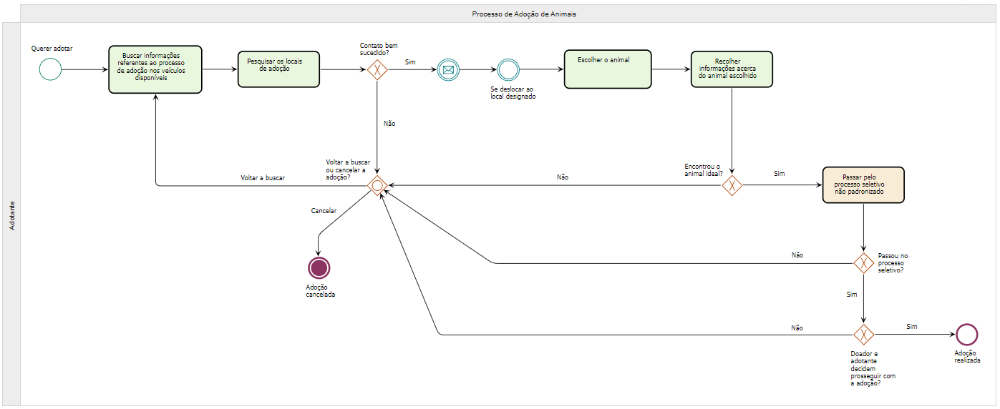

## 3.2. Descrição Geral da proposta

Como pode ser visto em nosso modelo de processo AS-IS referente à adoção, todos os processos são feitos de forma manual e não padronizada. Dessa forma, o desgaste de tempo para preencher as lacunas dos processos necessários para realizar a adoção e a facilidade da perda de informações são umas das consequências do modelo não ser padronizado e automatizado. Além da padronização do processo, a automatização traria consequências positivas tanto para aqueles que desejam adotar, quanto para os responsáveis pelo monitoramento do site. Haveria economia de tempo, e concentração de informações em apenas um lugar, também facilitaria as alterações de informações tanto dos animais quanto dos adotantes/doadores.  Com isso, se torna possível expandir o alcance acerca  das informações dos animais disponíveis para adoção, assim como proporcionar uma experiência mais prática e efetiva para um maior número de pessoas interessadas em se tornarem adotantes.

## 3.3. Modelagem dos Processos

No contexto de negócios da adoção de animais, foram escolhidos cinco processos para modelagem e aprimoramento (modelo TO-BE): adoção de animais, cadastro de adotantes, cadastro de doadores, gerenciar animais e gerenciar raças.

A partir das oportunidades identificadas no modelo AS-IS, objetivamos com as propostas de novos processos padronizar a estrutura do que se entende como adoção de animais - processo atualmente manual e sem um modelo estabelecido. Possibilitando com isso, segurança para os animais, clareza para os possíveis adotantes e confiança para os doadores. A proposta prioriza um novo modelo em poucos passos, com informações e requisitos claros para todos os envolvidos,  onde o solicitante tenha o resultado para sua solicitação em poucos dias e com a facilidade de ir até o local somente se aprovado. A análise do perfil do solicitante permite uma melhor adequação entre as partes e menos desgaste no processo. A instituição, por sua vez, com o novo processo de armazenamento de informações obtém não somente segurança em seus processos como informação atualizada podendo gerar relatórios e insights para serem utilizados como estratégia. 

### 3.3.1 Processo 1 – Gerenciar animais

Proposta de solução futura (modelo TO-BE) para o processo de gerenciar animais no sistema, permitindo a criação de um novo animal, a alteração dos dados de um animal já cadastrado e a exclusão do cadastro de um animal. Este modelo busca solucionar os problemas notados no modelo AS-IS:
- Antes registradas de forma manual e despadronizada em arquivos físicos, os dados do animal passarão a ser registrados em um banco de dados automatizado;
- O uso de um banco de dados facilitará a listagem e divulgação dos animais disponíveis para adoção;
- Os dados de cadastro do animal poderão ser alterados facilmente e de maneira remota, facilitando a disponibilização de informações atualizadas, além de contribuir para a redução de gastos com tempo e deslocamento, bem como o desgaste dos participantes emocionalmente envolvidos no processo.

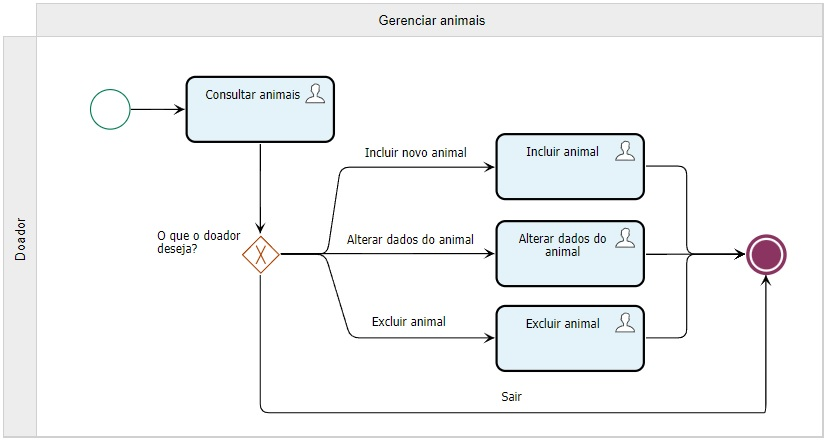

### 3.3.2 Processo 2 – Gerenciar adotantes

Proposta de solução futura (modelo TO-BE) para o processo de Cadastro de adotantes no sistema permitindo a consulta de dados já cadastrados, criação de um novo perfil de adotante, alteração dos dados do adotante cadastrado e a exclusão do perfil cadastrado.

Este modelo busca solucionar os problemas notados no modelo AS-IS:
- Antes registradas de forma manual e despadronizada em arquivos físicos, os dados do animal passarão a ser registrados em um banco de dados automatizado;
- Requisitos básicos para ter um cadastro registrado no banco de dados de acordo a informações solicitadas pelo sistema;
- Listagem atualizada de solicitantes de adoção possibilitando análise dos perfis.

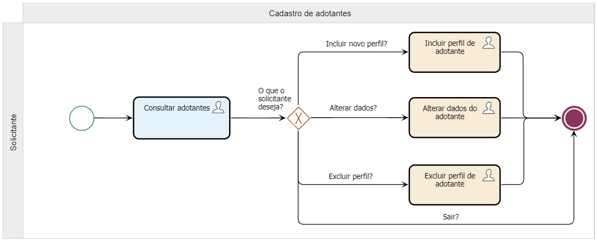

### 3.3.3 Processo 3 – Gerenciar doadores

Proposta de solução futura (modelo TO-BE) para o processo de cadastro de doadores no sistema permitindo a consulta de dados já cadastrados, criação de um novo perfil de doador, alteração dos dados do doador cadastrado e a exclusão do perfil cadastrado.
Este modelo busca solucionar os problemas notados no modelo AS-IS:
- Antes registradas de forma manual e despadronizada em arquivos físicos, os dados dos doadores passarão a ser registrados em um banco de dados automatizado;
- Armazenamento e atualizações de informações em tempo real proporcionando dados atualizados para consulta geral;
- Disponibilidade de condições e informações complementares para cada doador registrado.

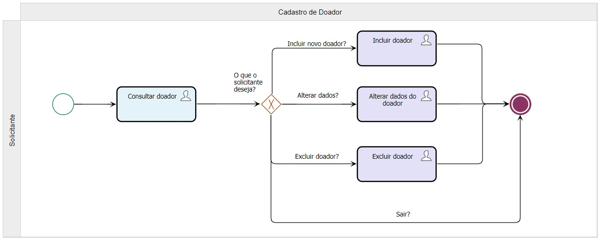

### 3.3.4 Processo 4 – Adoção de Animais

Fonte: Elaborado pelos autores na ferramenta Sydle One

Proposta de solução futura (modelo TO-BE) para o processo de adoção de animais, que descreve o processo executado pelo adotante onde irá realizar a escolha do animal, agendar e realizar entrevista, se aprovado,  assinar o termo de responsabilidade para concluir o processo. 
Este modelo busca solucionar os problemas notados no modelo AS-IS:
- Proporcionar padronização e segurança a solicitantes e animais;  
- Diminuir o desgaste emocional e monetário com tempo de deslocamento;
- Processo simplificado em 4 passos com clareza de informações e requisitos;
- Registro em banco de dados de todas as informações correspondentes a cada etapa do processo e atores envolvidos;
- Diminuir os números de devolução de animais por inadequação do perfil.

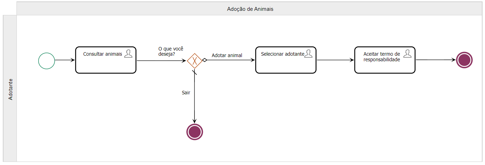

### 3.3.5 Processo 5 – Gerenciar raças

Proposta de solução futura (modelo TO-BE) para o processo de gerenciamento de raças no sistema permitindo a consulta de raças já cadastradas, criação de novas raças, alteração de raças cadastradas e a exclusão de raças cadastradas.

Este modelo busca solucionar os problemas notados no modelo AS-IS:

- Melhor organização e disponibilidade de animais para adoção em tempo real;
- Correta categorização dos perfis de animais cadastrar;
- Consulta e geração de inputs para priorização de animais e espécies.

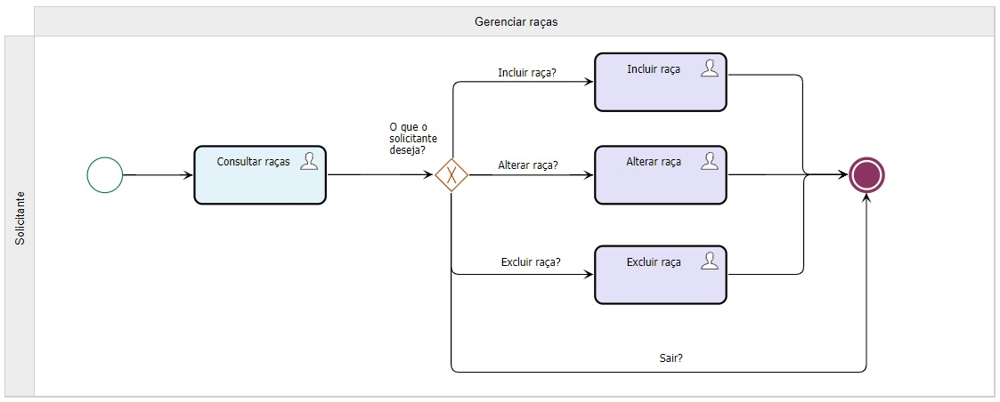

## 4. Projeto da arquitetura de dados da solução proposta

### 4.1. Diagrama de Entidades e Relacionamentos (DER)

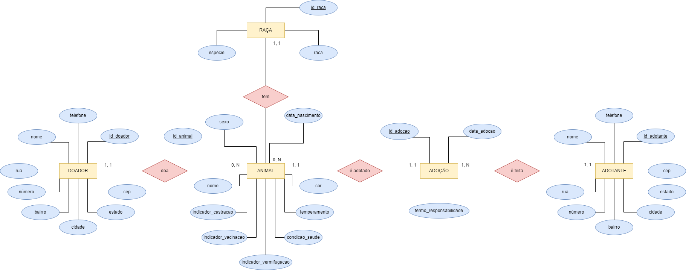

### 4.2. Impactos da implementação em um banco de dados NoSQL

Com o passar dos anos, a evolução tecnológica vem revolucionando a maneira como nos relacionamos entre si, com as máquinas, com informações, dados, etc. A forma como trocamos e criamos conteúdos na Web também nos auxilia a criar uma série de novas aplicações todo dia. O grande volume de dados criados por essas aplicações e a difusão de informações implica em uma nova era de banco de dados. Neste contexto, uma nova categoria de Banco de Dados (BD), chamada NoSQL, foi planejada com o objetivo de atender aos requisitos de administração de grandes volumes de dados, semi-estruturados ou não estruturados.

A necessidade de uma nova tecnologia de banco de dados surgiu como consequência da ineficiência dos bancos de dados relacionais em lidar com esta tarefa, já que os BD relacionais necessitam de uma estrutura pré definida para que ocorram as alterações. Em outras palavras, para que algo seja alterado em um banco de dados relacional, a informação já deve estar inclusa no sistema, assim, dificilmente, podendo adicionar algo à sua estrutura, além de serem “documentados” de uma só forma, por tabelas.

Armazenando grandes volumes de dados sem estrutura definida, um banco de dados NoSQL não limita os campos, assim podendo haver alterações/modificações no BD sem aviso prévio, as modificações não precisam estar pré definidas no BD para ocorrerem. Além disso, você pode adicionar novas propriedades conforme as necessidades dos negócios mudam, sem se preocupar com o impacto nas demais informações armazenadas. Um banco de dados NoSQL não requer o nível de preparação normalmente necessário para bancos de dados relacionais. A vantagem dos bancos não relacionais é a escalabilidade, além da flexibilidade da estruturação que, além de tornar a escalabilidade mais fácil, facilita a inserção e acesso aos dados.

Devido a isso, com a implementação de um BD NoSQL para o nosso projeto de adoção de animais, facilitaria e otimizaria as alterações referentes às informações dos animais. Dessa forma, a agilidade na troca de informações manteria o site sempre atualizado, assim permitindo uma melhor experiência ao usuário. Teríamos maior eficiência referente ao serviço de catalogar as informações dos animais e usuários do sistema. Além de todas essas vantagens, também haveria uma grande economia de tempo, diminuindo a sobrecarga dos funcionários responsáveis pela parte burocrática do centro de adoção, podendo estes direcionarem seus esforços para outras tarefas de similar importância.

## 4.3. Modelo relacional

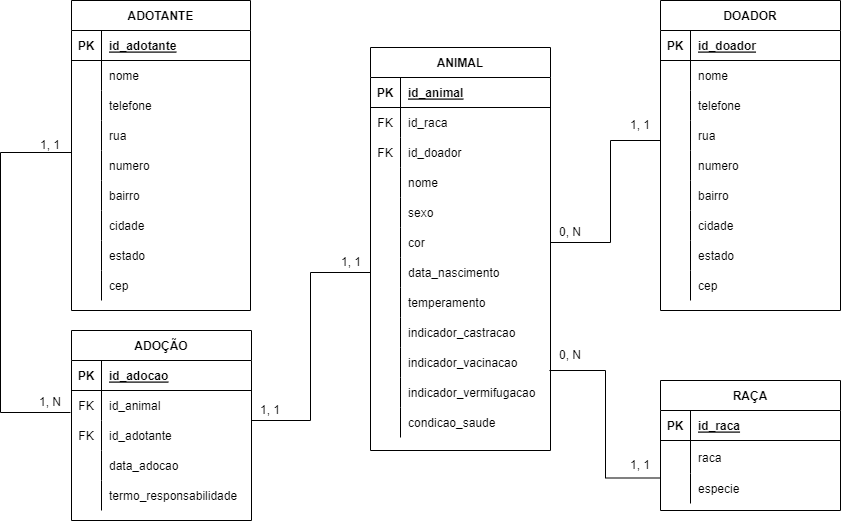

## 5. Relatórios analíticos

### 5.1. Relatório de adoções por adotante

Um relatório de adoções por adotante foi elaborado em forma de tabela com o objetivo de verificar as adoções realizadas em um determinado período, os adotantes envolvidos e a quantidade de adoções feitas.

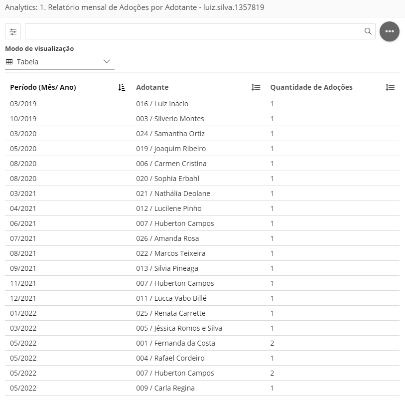

### 5.2. Relatório de origem

Foi elaborado um relatório de origem com o objetivo de permitir a visualização do estado onde se deram as adoções. Com a visualização por gráfico de barras, é possível identificar rapidamente os locais onde ocorreram a maioria das adoções.

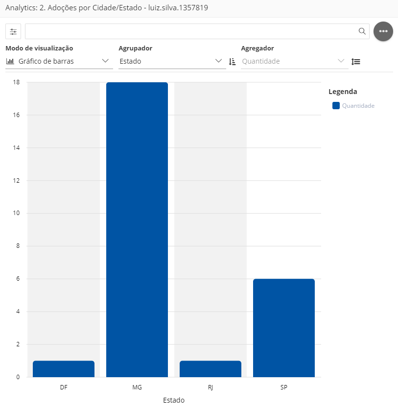

### 5.3. Quantidade de animais por espécie e sexo

Elaborou-se, também, uma tabela para visualização da quantidade de animais cadastrados para cada espécie e sexo.

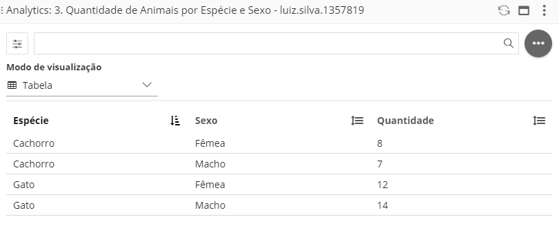

### 5.4. Animais adotados

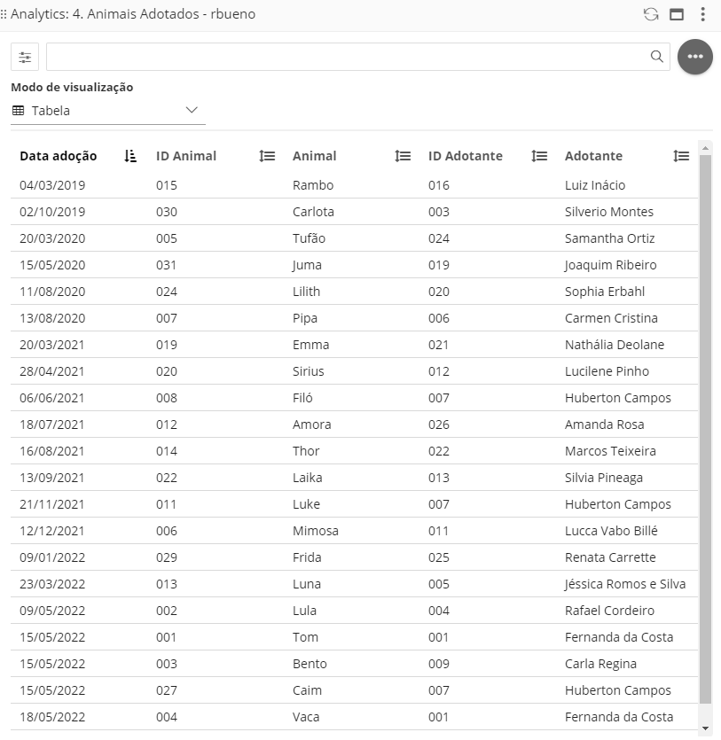

### 5.5. Associação de comandos SQL com relatórios analíticos

| **Nome do Relatório Analítico** | **Comando SQL-DML (SELECT)** |
| --- | --- |
| Animais adotados |  ```SELECT data_adocao, ani.id_animal, ani.nome, adt.id_adotante, adt.nome FROM animal ani, adocao ado, adotante adt <br> -- JOINS DAS TABELAS WHERE ani.id_animal = ado.id_animal AND ado.id_adotante = adt.id_adotante ORDER BY 1;``` |
| Animais por espécie e sexo | ```SELECT raca.especie, animal.sexo, COUNT(animal.sexo) AS Quantidade FROM animal, raca WHERE animal.id_raca = raca.id_raca GROUP BY raca.especie, animal.sexo;``` |
| Quantidade de adoções por estado/cidade | ```SELECT adotante.estado, -- adotante.cidade; COUNT(adocao.id_adocao) AS Quatidade_adocoes FROM adocao, adotante where adocao.id_adotante = adotante.id_adotante GROUP BY adotante.estado; -- GROUP BY adotante.cidade;``` |
| Relatório mensal de quantidade de adoções por adotante | ```SELECT MONTH(data_adocao), adocao.id_adotante, adotante.nome, count(id_adocao) as Quantidade_de_adocao FROM adocao, adotante WHERE adocao.id_adotante = adotante.id_adotante GROUP BY MONTH(adocao.data_adocao), adotante.nome;``` |

## 6. Indicadores de desempenho

Detalhamos na tabela abaixo 5 indicadores de desempenho que identificam os processos desenvolvidos para a atividade tema do projeto. Estão descritos indicadores que nos permitem, a partir dos relatórios de análise resultantes da ferramenta Sydle One, ter uma visão estratégica quanto à entrada, processos de desenvolvimento e finalidade da atividade. Buscando não somente entender sobre os resultados como também poder analisar o contexto preliminar e posterior ao processo. Assim, permitindo gerar insights para ações preventivas e e retroalimentação do processo como um todo.

| **Indicador** | **Objetivo** | **Descrição** | **Fórmula de cálculo** | **Fontes de dados** | **Perspectiva** |
| --- | --- | --- | --- | --- | --- |
| Percentual de adoções por período - PAP | Avaliar percentualmente nº de adoções x período | Permite identificar percentual de adoções em determinado período | nº 1° bimestre 2020nº total de adoção*100 | Tabela | 1. Relatório de Adoções por Adotante Crescimento (Campanhas de adoção para períodos de baixa vs ano/ período anterior) |
| Perfil de origem (adotantes) - POA | Identificação da origem de perfil cadastrado | Mede % de adotantes por cidade e estado | nº adotantes Mun/ UFnº total de adotantes*100 | 2. Relatório de Origem Registro e crescimento (Potencializar áreas com poucos adotantes) |
| Base de Animais por espécie /gênero - BAE - BAG | Avaliar índices de entrada e saída segundo espécie e sexo | Distribuicao de animais por espécie e sexo | nº Espécie ou sexonº total de animais*100 | 3. Quantidade de Animais por Espécie e Sexo | Processos Internos (Priorização e campanhas divulgação) |
| Perfil de origem (doadores) - POD | Identificação de origem de animais doados | Percentual de doações por Município/ UF | nº adotantes Mun/ UFnº total de doadores*100 | Relatório de Origem (Doadores) + 3. Quantidade de Animais Registro e Aprendizado (Identificar possíveis focos de abandono ou mesmo conscientização sobre o tema) |
| Índice de conversão de adoções - ICA | Melhorar a taxa de conversão de adoções | Identificar % de cadastros convertidos em adoção | nº total de adoçõesnº total de adotantes*100 | 4. Animais Adotados + Registro de adotantes Adotantes (melhorar fatores que possam estar impossibilitando o processo) |

## 7. Conclusão

O projeto como vetor de transformação para o tema proposto gerou a partir da demanda diagnosticada uma nova perspectiva de performance para o processo de adoção de animais. A partir da solução proposta (Modelo TO BE), é possível evidenciar melhorias na estrutura anterior diagnosticada (Modelo AS IS), são elas: 

- Registro ágil e seguro de agentes (doadores, adotantes) e animais;
- Base de dados ativa e atualizada para consulta em tempo real;
- Relatórios analiticos que possibilitam melhor estratégia para campanhas e ações;
- Importante ressaltar que como etapa de implementação do processo o objetivo é alcançado, porém evidenciamos algumas limitações a versão implementada.. 
- Possibilidade de adoção de cada animal por vez;
- Ausência de um sistema de vídeo chamada que possibilite “entrevistas”; 
- Opção de upload/ download do “Termo de Responsabilidade”.
- Como novas oportunidades para versões futuras é possível pensar em dinâmicas como seguimento do animal adotado e gerenciamento de marcas parceiras.

# REFERÊNCIAS

**[1]** - _DAVIES, Jordan. **Covid-19: o grande abandono de cães comprados na pandemia**. BBC News, 2021. Disponível em: <https://www.bbc.com/portuguese/geral-59024237>. Acesso em: 15 de março de 2022._

**[1]** - _INSTITUTO PET BRASIL. **Anuário Pet 2020**. Disponível em: <http://institutopetbrasil.com/wp-content/uploads/2020/10/PETBRASIL_Inbook_20200924_preview.pdf>. Acesso em: 17 de março de 2022._

**[1]** - _SOUZA, Ludmilla. **Dezembro Verde alerta sobre maus-tratos e abandono de animais**. Agência Brasil, 2020. Disponível em: <https://agenciabrasil.ebc.com.br/geral/noticia/2020-12/dezembro-verde-alerta-sobre-maus-tratos-e-abandono-de-animais>. Acesso em: 11 de março de 2022._

**[1]** - _VEIGA, Edison. **A 'epidemia de abandono' dos animais de estimação na crise do coronavírus**. BBC News, 2020. Disponível em: <https://www.bbc.com/portuguese/brasil-53594179>. Acesso em: 12 de março de 2022._

**[1]** - _SCHEFFER, Gisele Kronhardt. **Abandono de animais: um crime silencioso**. Canal Ciências Criminais, 2018. Disponível em: <https://canalcienciascriminais.com.br/abandono-animais-crime-silencioso/>. Acesso em: 12 de março de 2022._

**[1]** - _SILVA, Lariça Maria da. **Animais em situação de rua: Cartilha pedagógica para cuidados dos animais em situação de rua**. Disponível em: <https://www1.ufrb.edu.br/gestaopublica/images/phocadownload/20191_TCCdefendidos/SILVA_Nota_Tecnica_Cartilha_Animais_Situacao_Rua.pdf>. Acesso em: 12 de março de 2022._

**[1]** - _PREFEITURA MUNICIPAL DE SÃO PAULO. **Adoção**. Disponível em: <https://www.prefeitura.sp.gov.br/cidade/secretarias/saude/saude_e_protecao_ao_animal_domestico/index.php?p=272491>. Acesso em: 12 de março de 2022._

# APÊNDICES

**Colocar link:**

Do código (armazenado no repositório);

Dos artefatos (armazenado do repositório);

Da apresentação final (armazenado no repositório);

Do vídeo de apresentação (armazenado no repositório).